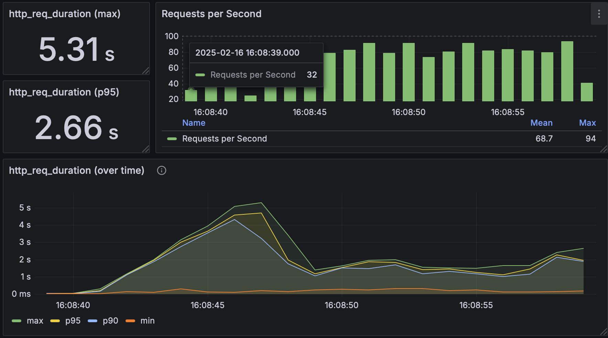
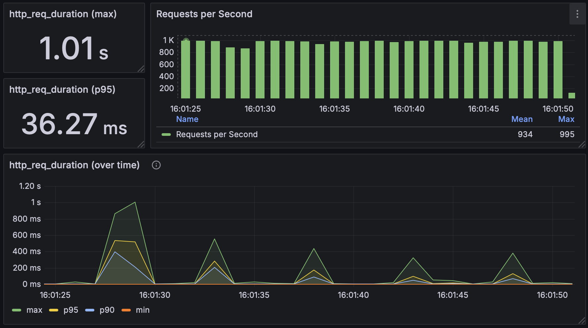
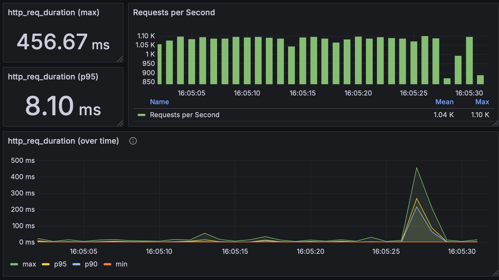
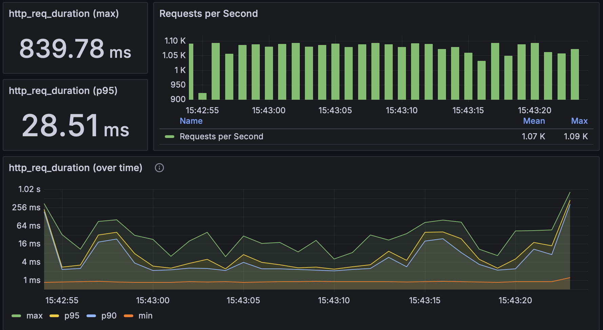
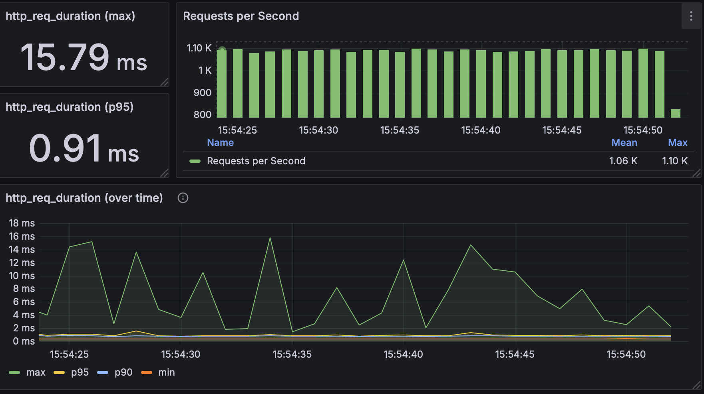

# Магазин мерча Авито - Тестовое задание

Сервис для внутреннего магазина мерча Авито, где сотрудники могут приобретать товары за внутреннюю валюту (coin) и
обмениваться монетами между собой. Реализовано в рамках тестового задания для стажировки Backend Winter 2025.

[Исходное тестовое задание](https://github.com/avito-tech/tech-internship/blob/main/Tech%20Internships/Backend/Backend-trainee-assignment-winter-2025/Backend-trainee-assignment-winter-2025.md)

## Функциональность

- Авторизация и регистрация пользователей с помощью JWT
- Покупка доступных товаров
- Передача монет между пользователями
- Просмотр инвентаря и истории передачи монет

## Запуск

1. Скопируйте файл конфигурации:

```shell
cp .env.example .env
```

2. Запустите сервис через Docker:

```shell
docker compose up
```

Сервис будет доступен по адресу `localhost:8080`

## Тестирование

### Unit и интеграционные тесты

1. Сгенерируйте моки:

```shell
make gen
```

2. Запустите интеграционные и unit тесты:

```shell
make test
```

Процент покрытия проекта тестами `43.2%`


### Нагрузочное тестирование

Для нагрузочного тестирования используется k6. Доступны следующие сценарии:

- `auth` - тестирование авторизации
- `buy` - тестирование покупки товаров
- `sendCoin` - тестирование передачи монет
- `info` - тестирование информационных запросов

Запуск сценария:

```shell
docker run --rm -i grafana/k6 run --env SCENARIO=<ИМЯ_СЦЕНАРИЯ> - <load_testing.js
```

#### Мониторинг в Grafana

<details>
<summary>Инструкция по настройке мониторинга</summary>

1. Создайте Docker-сеть:

```shell
docker network create k6-network
```

2. Запустите InfluxDB:

```shell
docker run -d \
    --name influxdb \
    --network k6-network \
    -p 8086:8086 \
    -e INFLUXDB_DB=k6 \
    -e INFLUXDB_HTTP_AUTH_ENABLED=false \
    -e INFLUXDB_ADMIN_USER=admin \
    -e INFLUXDB_ADMIN_PASSWORD=admin \
    influxdb:1.8
```

3. Запустите Grafana:

```shell
docker run -d \
    --name grafana \
    --network k6-network \
    -p 3000:3000 \
    -e "GF_AUTH_ANONYMOUS_ENABLED=true" \
    -e "GF_AUTH_ANONYMOUS_ORG_ROLE=Admin" \
    -e "GF_AUTH_DISABLE_LOGIN_FORM=true" \
    grafana/grafana-oss
```

4. Запустите тест с отправкой метрик в InfluxDB:

```shell
docker run --rm -i grafana/k6 run --env SCENARIO=<ИМЯ_СЦЕНАРИЯ> --out influxdb=http://host.docker.internal:8086/k6 - <load_testing.js
```

</details>

### Подготовка данных для тестирования

После запуска сценария `auth` необходимо обновить баланс созданных пользователей для последующего тестирования сценариев
`sendCoin` и `buy`:

```postgresql
UPDATE users
SET balance = 10000000;
```

## Результаты нагрузочного тестирования

| Сценарий | Токенов | RPS  | p(95) ms | Узкое место        |
|----------|---------|------|----------|--------------------|
| auth     | 1       | 100  | 2660     | Хэширование пароля |
| sendCoin | 10      | 1000 | 36.27    | Блокировка PgSQL   |
| sendCoin | 100     | 1100 | 8.10     | Блокировка PgSQL   |
| buy      | 10      | 1100 | 28.51    | Блокировка PgSQL   |
| info     | 10      | 1100 | 0.91     | Нет                |

> При высокой нагрузке операции `sendCoin` и `buy` демонстрируют проблемы производительности из-за блокировок на уровне
> строк в PostgreSQL. Когда несколько транзакций пытаются одновременно обновить баланс одного и того же пользователя,
> возникает последовательное выполнение операций. Однако при тестировании с большим количеством пользователей (100 токенов
> вместо 10) производительность улучшается, так как запросы распределяются по разным строкам таблицы, что уменьшает
> количество конкурентных блокировок и позволяет базе данных лучше распараллеливать операции.

### Графики нагрузочного тестирования

<details>
<summary>Скриншоты результатов</summary>

#### scenario: auth; tokens: 1; rps: 100



#### scenario: sendCoin; tokens: 10; rps: 1000



#### scenario: sendCoin; tokens: 100; rps: 1100



#### scenario: buy; tokens: 10; rps: 1100



#### scenario: info; tokens: 10; rps: 1100



</details>